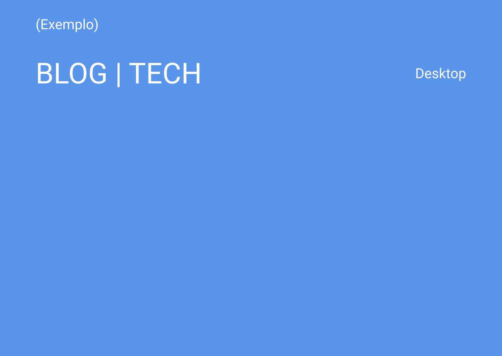

<h1 align="center">
 Blog | Tech
</h1>


<h1 align="center">
    
</h1>


<br>

## 🧪 Technologies

This project was developed using the following technologies:

- [Next](https://nextjs.org/)
- [React](https://reactjs.org)
- [Firebase](https://firebase.google.com/)
- [Dato - CMS](https://www.datocms.com/)

## 🚀 Getting started

Clone the project and access the folder.

```bash
$ https://github.com/Luis-Felipe-N/blog.git
$ cd blog
```

Follow the steps below:
```bash
# Install the dependencies
$ npm install

# Start the project
$ npm run dev
```
The app will be available for access on your browser at http://localhost:3000

## 📝 License

This project is licensed under the MIT License. See the [LICENSE](LICENSE.md) file for details.


---

<p align="center">Made with 💛 by Luis Felipe</p># opinia-PHD-
